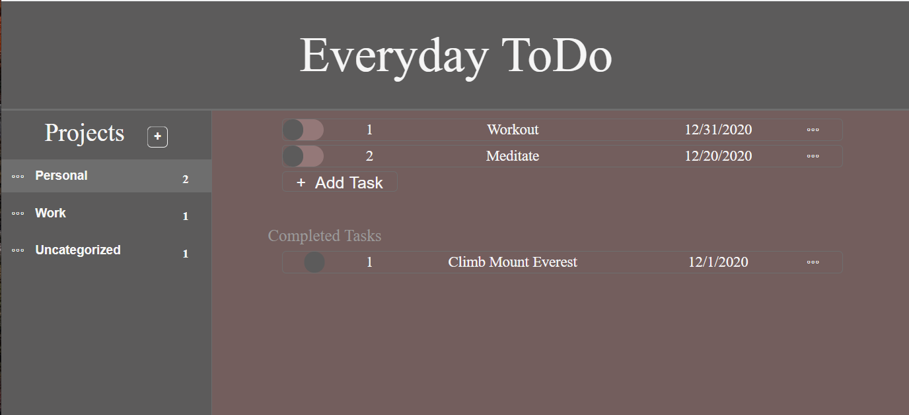

# TOP-ToDoList

Here's a simple ToDo list using localstorage to store data.

The tasks are assigned to projects and require a project home. The parent knows the children so continuosly looping through an array of tasks is cut out.

v1 - functionality w/out localstorage for ability to implement other storage later (ie postgres)

v2 - added localstorage

If I was to further develope here's my next steps:

    Re-align the html structure and move one-off js created items to html
    Give the CSS a makeover
        editing and adding projects/tasks especially
        slider nav
    Condense the functions
    Add abilities
        option to show/hide completed tasks per project
        drill down what function the "uncategorized" project should serve
        don't allow changing the uncategorized name
        clear origDataset
		re-populate origDataset

